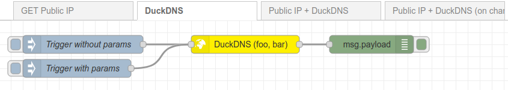
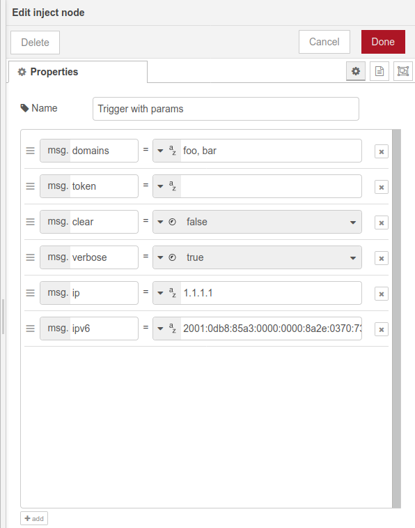
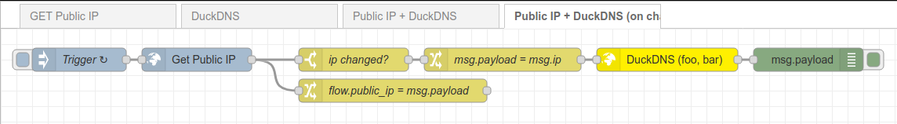

# node-red-contrib-duckdns

Node-RED node to update Dynamic DNS domains on [DuckDNS](https://www.duckdns.org), using [its API](https://www.duckdns.org/spec.jsp).

## Configuration

All the configuration for the node can be set up on the node itself, or as keys of the injected message (e.g. the "token" can be sent through `msg.token`).
The message-provided configurations have more priority than those defined on the node itself.

- **token** (required): the DuckDNS user token.
- **domains** (required): the domains to update. Multiple domains can be updated at the same time, specifying them comma-separated. The domains do not need to have the ".duckdns.org" part.
- **ip**: the destination IP for the domain/s. Can be a IPv4 or IPv6. When this property is not set, nor configured on the node, DuckDNS will autodetect the IP (from where the request was performed).
- **ipv6**: the destination IPv6 for the domain/s. If set, the IP autodetection is disabled.
- **clear**: if true, clear the IP address/es already assigned to the domain/s.
- **verbose**: if true, make DuckDNS return a verbose response, which is returned as the payload output of the node.

## Examples

### DuckDNS

The typical configuration is based on calling the DuckDNS API periodically, providing just the token and the domain/s to update.
The API will automatically detect our public IP address, and update our domains if the IP changes.

The message injected into the DuckDNS node can contain configuration fields, which will replace those configurated on the node itself, if specified:

### Public IP + DuckDNS (on change)

To be more efficient, we could use a [GET Public IP](https://flows.nodered.org/node/node-red-contrib-public-ip-address) service to get our public IP, and if it changes, ask DuckDNS to update our domain/s. This can be useful to also notify us (somehow) whenever the IP changes.

## Changelog

- 0.0.1
    - initial release

## TODO

- Improve format of node configuration (HTML)
- Return a parsed object message payload when verbose=true
- Add tests
